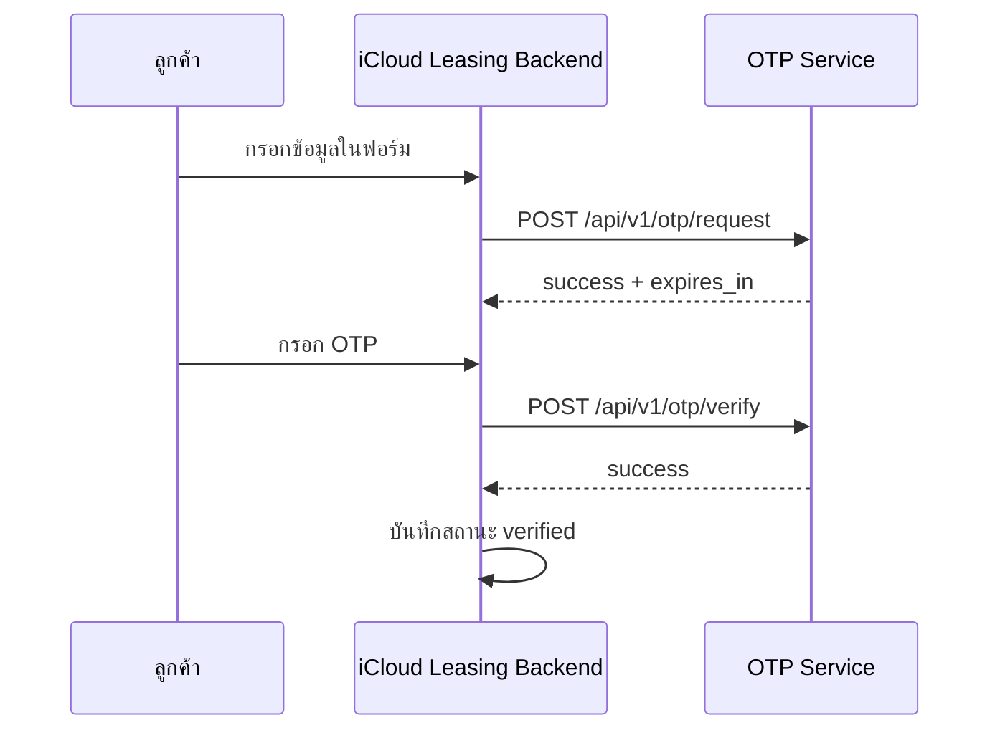

# คู่มือเชื่อมระบบ OTP กับ iCloud Leasing

เอกสารฉบับนี้เขียนสำหรับทีม dev ของ iCloud Leasing เพื่อเชื่อมระบบหลังบ้านกับ OTP Service ของเราโดยตรง

เป้าหมายคือให้ระบบของคุณเรียก OTP ผ่าน API ได้ทันที โดยไม่ต้องพาผู้ใช้ไปเปิดเว็บ `otpverify.icashbank.com`

## สรุปสั้น

สิ่งที่ dev ต้องทำมีแค่นี้

1. ตั้งค่า `X-API-Key` ให้ถูกต้องใน backend ของ iCloud Leasing
2. เรียก `POST /api/v1/otp/request` เพื่อขอ OTP
3. รับ OTP จากผู้ใช้ในหน้าของ iCloud Leasing เอง
4. เรียก `POST /api/v1/otp/verify` เพื่อยืนยัน OTP
5. ถ้าผ่าน ให้บันทึกสถานะ verified ในระบบของคุณต่อ

ถ้าต้องการเก็บประวัติลูกค้าฝั่ง OTP Service ด้วย ให้ใช้ `POST /api/v1/customers`

---

## ภาพรวมการเชื่อมต่อ

รูปแบบที่แนะนำคือ `server-to-server`

- ระบบ iCloud Leasing เป็นคนเรียก API
- ผู้ใช้กรอก OTP ในหน้าของ iCloud Leasing เอง
- ระบบ iCloud Leasing เป็นคนส่ง OTP ไปตรวจที่ OTP Service
- ถ้ายืนยันผ่าน ให้ระบบ iCloud Leasing ทำขั้นตอนถัดไปต่อ

---

## สิ่งที่ต้องมี

ฝั่ง iCloud Leasing ต้องเตรียมสิ่งเหล่านี้

- Base URL ของ OTP Service
- API key สำหรับ production และ staging
- เบอร์โทรศัพท์ของลูกค้า
- OTP ที่ผู้ใช้กรอกกลับมา
- รหัสอ้างอิงของรายการสมัครหรือ customer ID ถ้าต้องการบันทึกข้อมูลลูกค้า

## URL ที่ใช้ได้

ตัวอย่าง URL สำหรับทดสอบภายใน

- Local: `http://127.0.0.1:8000`
- Production: `https://otpverify.icashbank.com`

ให้ dev เปลี่ยนตาม environment ที่ใช้งานจริงของคุณ

## ค่าที่ต้องตั้งบนฝั่ง OTP Service

ระบบ OTP Service ต้องมีค่าเหล่านี้ใน environment

- `EXTERNAL_API_KEYS`
- `EXTERNAL_API_HEADER_NAME` โดยปกติใช้ `X-API-Key`
- `EXTERNAL_API_RATE_LIMIT` โดยปกติใช้ `60/minute`

ตัวอย่าง:

```env
EXTERNAL_API_KEYS=key-one,key-two
EXTERNAL_API_HEADER_NAME=X-API-Key
EXTERNAL_API_RATE_LIMIT=60/minute
```

---

## การยืนยันตัวตน

API ของเราใช้ header นี้

```http
X-API-Key: your-secret-key
```

ค่าคีย์ต้องตรงกับ `EXTERNAL_API_KEYS` ที่ตั้งไว้บนเซิร์ฟเวอร์

ถ้าไม่ส่ง key หรือส่ง key ผิด ระบบจะตอบ `401`

แนะนำ:

- อย่าใส่ key ไว้ใน frontend
- ให้ระบบ backend ของ iCloud Leasing เป็นคนเรียก API เท่านั้น
- แยก key คนละชุดสำหรับ staging และ production
- ถ้า production key หลุด ให้ rotate ทันที

---

## Base URL

API ใช้ path แบบ versioned

```text
/api/v1
```

ตัวอย่าง:

```text
https://your-domain.example.com/api/v1/otp/request
```

---

## Flow ที่แนะนำ

### Flow หลักสำหรับยืนยัน OTP

1. เจ้าหน้าที่กรอกข้อมูลลูกค้าในระบบ iCloud Leasing
2. Backend ของ iCloud Leasing เรียก `POST /api/v1/otp/request`
3. OTP Service ส่ง OTP ไปยังเบอร์ลูกค้า
4. ผู้ใช้กรอก OTP กลับในระบบ iCloud Leasing
5. Backend ของ iCloud Leasing เรียก `POST /api/v1/otp/verify`
6. ถ้าผ่าน ให้ระบบ iCloud Leasing บันทึกสถานะ verified และไปขั้นตอนถัดไป

### Flow เสริมสำหรับบันทึกข้อมูลลูกค้า

ถ้าต้องการเก็บข้อมูลลูกค้าไว้ใน OTP Service ด้วย ให้เรียก `POST /api/v1/customers`

ใช้กรณี:

- เก็บประวัติการยืนยัน OTP
- ซิงก์ข้อมูลลูกค้าไปยังหลังบ้านอีกระบบ
- ตรวจสอบรายการย้อนหลัง

---

## แผนภาพการทำงาน



---

## Endpoint ที่ใช้งานจริง

| Method | Path | ใช้ทำอะไร |
| --- | --- | --- |
| `GET` | `/api/v1/status` | ตรวจสอบว่าระบบพร้อมใช้งาน |
| `POST` | `/api/v1/otp/request` | ขอ OTP |
| `POST` | `/api/v1/otp/verify` | ยืนยัน OTP |
| `GET` | `/api/v1/customers` | ดึงข้อมูลลูกค้าทั้งหมด |
| `GET` | `/api/v1/customers/{customer_id}` | ดึงข้อมูลลูกค้าทีละรายการ |
| `POST` | `/api/v1/customers` | สร้างหรืออัปเดตลูกค้า |
| `PUT` | `/api/v1/customers/{customer_id}` | อัปเดตลูกค้าตาม id |
| `DELETE` | `/api/v1/customers/{customer_id}` | ลบลูกค้า |

## Response ที่ต้องรองรับในระบบ iCloud Leasing

ให้ฝั่ง dev เตรียมรับ response เหล่านี้

### `401 Unauthorized`

เกิดจาก key ผิดหรือไม่ได้ส่ง

```json
{
  "detail": "A valid API key is required."
}
```

### `429 Too Many Requests`

เกิดจากเรียกถี่เกิน

```json
{
  "detail": "Too many OTP requests. Please wait a moment and try again."
}
```

### `503 Service Unavailable`

เกิดจากระบบยังไม่พร้อมใช้งาน หรือยังไม่เปิด external API

```json
{
  "detail": "External API is not configured. Set EXTERNAL_API_KEYS to enable it."
}
```

---

## รายละเอียด Endpoint

### 1) `GET /api/v1/status`

ใช้ตรวจว่าระบบพร้อมใช้งานหรือไม่

ตัวอย่าง:

```bash
curl -H "X-API-Key: your-secret-key" \
  https://your-domain.example.com/api/v1/status
```

ตัวอย่าง response:

```json
{
  "status": "ok",
  "api_version": "v1",
  "app_version": "v0.0.2",
  "provider": "plasgate",
  "dev_mode": false,
  "external_api_enabled": true,
  "redis_backend": "redis",
  "redis_status": "ok"
}
```

### 2) `POST /api/v1/otp/request`

ใช้ขอ OTP

Request body:

```json
{
  "phone": "0812345678",
  "lang": "en"
}
```

ฟิลด์:

- `phone` จำเป็น
- `lang` ไม่บังคับ แต่แนะนำใช้ `en` สำหรับการเชื่อมระบบนี้

ตัวอย่าง response:

```json
{
  "status": "success",
  "expires_in": 300
}
```

ถ้าเบอร์ผิด format หรือระบบไม่พร้อมใช้งาน ให้ฝั่ง dev พร้อมแสดง error message ที่รับกลับมาโดยตรง

### 3) `POST /api/v1/otp/verify`

ใช้ยืนยัน OTP

Request body:

```json
{
  "phone": "0812345678",
  "otp": "123456",
  "lang": "en"
}
```

ตัวอย่าง response:

```json
{
  "status": "success",
  "message": "OTP verified successfully."
}
```

ถ้า OTP ผิดให้ระบบของคุณแสดงข้อความล้มเหลวและให้ผู้ใช้ลองใหม่ได้ตาม policy ของ iCloud Leasing

### 4) `GET /api/v1/customers`

ดึงข้อมูลลูกค้าทั้งหมด

ตัวอย่าง response:

```json
{
  "customers": []
}
```

### 5) `GET /api/v1/customers/{customer_id}`

ดึงข้อมูลลูกค้าตามรหัส

ตัวอย่าง:

```bash
curl -H "X-API-Key: your-secret-key" \
  https://your-domain.example.com/api/v1/customers/CUS-001
```

### 6) `POST /api/v1/customers`

ใช้สร้างหรืออัปเดตข้อมูลลูกค้า

Request body:

```json
{
  "id": "CUS-001",
  "name": "Sokha Chan",
  "phone_number": "0971234567",
  "otp": "123456",
  "timestamp": "2026-05-06T09:18:47Z"
}
```

พฤติกรรม:

- ถ้า `id` ซ้ำ ระบบจะอัปเดตข้อมูลเดิม
- ถ้า `id` ยังไม่มี ระบบจะสร้างใหม่
- ถ้า `timestamp` ว่าง ระบบจะเติมเวลาให้เอง

แนะนำให้ใช้ endpoint นี้เมื่อ:

- ต้องการเก็บผลการ verify ไว้ตรวจสอบย้อนหลัง
- ต้องการ sync customer record ไปยัง OTP Service
- ต้องการใช้ OTP Service เป็นแหล่งข้อมูลกลาง

### 7) `PUT /api/v1/customers/{customer_id}`

ใช้อัปเดตลูกค้าแบบชัดเจน

กติกา:

- `customer_id` ใน URL ต้องตรงกับ `id` ใน body
- ถ้าไม่ตรงกัน ระบบจะตอบ `400`

### 8) `DELETE /api/v1/customers/{customer_id}`

ใช้ลบข้อมูลลูกค้า

ตัวอย่าง response:

```json
{
  "message": "Customer deleted successfully."
}
```

---

## Field Mapping สำหรับ iCloud Leasing

| ฟอร์มของ iCloud Leasing | ฟิลด์ที่ส่งไป OTP Service |
| --- | --- |
| เบอร์โทรลูกค้า | `phone` |
| OTP ที่ผู้ใช้กรอก | `otp` |
| ภาษา SMS | `lang` |
| เลขอ้างอิงลูกค้า / เลขรายการสมัคร | `id` |
| ชื่อลูกค้า | `name` |
| เบอร์โทร | `phone_number` |
| เวลาใช้งาน / เวลาบันทึก | `timestamp` |

คำแนะนำ:

- ใช้ `id` เป็นเลขอ้างอิงของระบบคุณ เช่น application number หรือ customer reference
- ใช้ `phone_number` เป็นเบอร์ที่ใช้ขอและยืนยัน OTP
- ถ้าไม่ต้องการเก็บข้อมูลลูกค้าใน OTP Service ก็ใช้เฉพาะ OTP endpoint ได้

---

## ตัวอย่าง request ที่ควรส่งจาก backend

### ขอ OTP

```http
POST /api/v1/otp/request
X-API-Key: your-secret-key
Content-Type: application/json

{
  "phone": "0812345678",
  "lang": "en"
}
```

### ยืนยัน OTP

```http
POST /api/v1/otp/verify
X-API-Key: your-secret-key
Content-Type: application/json

{
  "phone": "0812345678",
  "otp": "123456",
  "lang": "en"
}
```

### บันทึก/อัปเดตข้อมูลลูกค้า

```http
POST /api/v1/customers
X-API-Key: your-secret-key
Content-Type: application/json

{
  "id": "APP-20260515-001",
  "name": "Sokha Chan",
  "phone_number": "0812345678",
  "otp": "123456",
  "timestamp": "2026-05-15T10:00:00Z"
}
```

---

## การจัดการ error

ฝั่ง dev ควรเตรียมรับสถานะเหล่านี้

- `200` สำเร็จ
- `400` ข้อมูล request ไม่ถูกต้อง
- `401` API key ผิดหรือไม่ได้ส่ง
- `404` ไม่พบข้อมูล
- `429` ถูกจำกัดจำนวนครั้ง
- `503` ระบบยังไม่พร้อมใช้งาน

แนวทางรับมือ:

- `401` ตรวจ key และ header
- `429` หยุด retry ชั่วคราว แล้วรอ
- `503` retry หลังจากนั้น
- `400` ตรวจ body ที่ส่งไป

---

## ข้อแนะนำด้านความปลอดภัย

- เรียก API จาก backend เท่านั้น
- อย่าใส่ key ไว้ในหน้าเว็บหรือ JavaScript ฝั่ง browser
- แยก key คนละชุดระหว่าง staging กับ production
- ถ้า key หลุด ให้ rotate ทันที
- ควร log เฉพาะผลลัพธ์ ไม่ log key จริง

---

## ตัวแปรที่ต้องตั้งในระบบคุณ

```env
EXTERNAL_API_KEYS=key-one,key-two
EXTERNAL_API_HEADER_NAME=X-API-Key
EXTERNAL_API_RATE_LIMIT=60/minute
```

---

## ขั้นตอนทำงานสำหรับ dev ฝั่ง iCloud Leasing

### 1) ตั้งค่า config

ให้ dev ใส่ค่า environment ของ backend ดังนี้

```env
OTP_API_BASE_URL=https://otpverify.icashbank.com
OTP_API_KEY=your-secret-key
OTP_API_HEADER_NAME=X-API-Key
```

### 2) เรียกขอ OTP

ใช้ `OTP_API_BASE_URL + /api/v1/otp/request`

### 3) รับ OTP จากผู้ใช้

ให้ผู้ใช้กรอก OTP ในหน้าของ iCloud Leasing เอง

### 4) ตรวจ OTP

ใช้ `OTP_API_BASE_URL + /api/v1/otp/verify`

### 5) บันทึกผล

ถ้าผ่าน ให้ mark เป็น verified ภายในระบบ iCloud Leasing และไป step ถัดไป

---

## สรุปสั้นสำหรับ dev

สิ่งที่ต้องทำฝั่ง iCloud Leasing มี 3 ขั้น

1. เรียก `POST /api/v1/otp/request`
2. รับ OTP จากผู้ใช้
3. เรียก `POST /api/v1/otp/verify`

ถ้าต้องการเก็บข้อมูลลูกค้าใน OTP Service เพิ่ม ให้ใช้ `POST /api/v1/customers`

เอกสารอ้างอิงฉบับเต็ม:

- [API.md](/D:/OTP_project/API.md)
